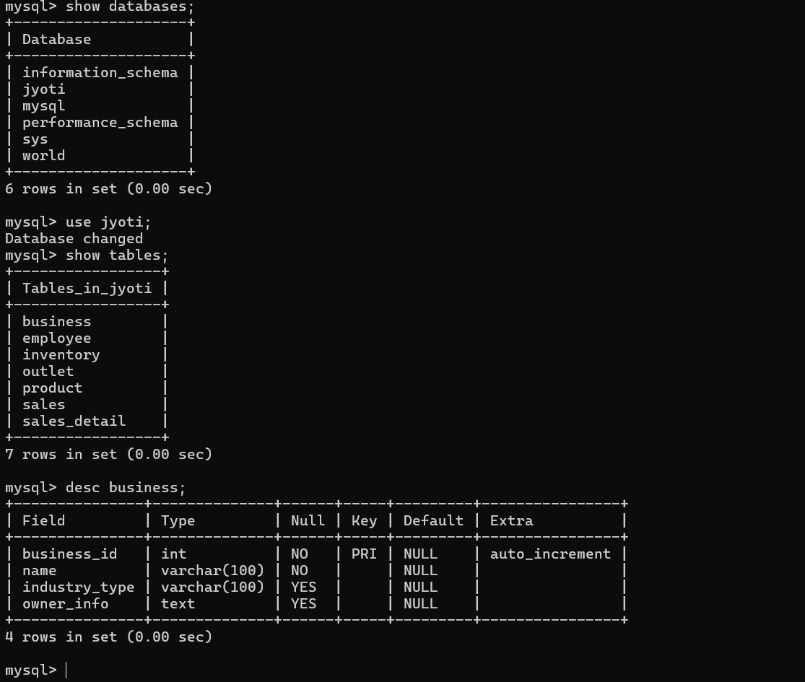

# Cloud-Based Multi-Outlet Management System

## Overview

The **Cloud-Based Multi-Outlet Management System** is a comprehensive solution designed to streamline operations for businesses with multiple outlets—such as supershops and restaurants. The system centralizes inventory management, order processing, and customer data across all outlets, offering real-time updates and robust analytics. This project integrates core software engineering principles with distributed database management systems (DDMS) and a structured software development process (SDP).

## Motivation

This project aims to address key operational challenges faced by multi-outlet businesses:
- **Operational Efficiency:** Enable real-time data synchronization across outlets.
- **Informed Decision-Making:** Provide accurate analytics for inventory, sales, and customer trends.
- **Academic & Research Value:** Serve as a platform with strong potential for academic publication and support for higher studies (MSc in USA).
- **Entrepreneurial Opportunity:** Develop a market-ready product appealing to entrepreneurs looking for scalable, cloud-based management solutions.

## Features

- **Centralized Dashboard:** Manage inventory, orders, and customer information from one unified interface.
- **Real-Time Synchronization:** Distributed database technology ensures that data across multiple outlets is always up-to-date.
- **Analytics & Reporting:** Generate detailed reports to aid in business decision-making.
- **User Management:** Secure, role-based access control for different levels of users.
- **Scalability:** Designed to accommodate business growth with ease.

## Technologies Used

- **Backend:** Node.js/Express (or your chosen backend framework)
- **Frontend:** React/Angular/Vue.js (or your chosen frontend framework)
- **Database:** MongoDB/MySQL/PostgreSQL (configured for distributed management)
- **Cloud Services:** AWS, Google Cloud, or Azure for hosting and scalability
- **Other Tools:** Docker for containerization, Git for version control, etc.

## Team

Our dedicated team of five members includes:

Sanzida Hossain 22234103161 UI/UX, Frontend Developers

Akib Ibna Sunny 22234103072 Backend Developer

Sumaia Afrose Joty 22234103191 Data Analyst & DBA

Ozifa Rahman 22234103200 UI/UX, Frontend Developers

MD. Mehedi Hasan 21225103380 Full Stack Developer & Backend Developer


## Installation

1. **Clone the Repository:**
   ```bash
   git clone https://github.com/Toxic-Shadow-1010/cloud-multi-outlet-management.git


## Database
### Schema Diagram


---

### Tables and Attributes

#### 🏢 Business  
**Attributes:**  
- `business_id` *(Primary Key)*  
- `name`  
- `industry_type`  
- `owner_info`  

#### 🏬 Outlet  
**Attributes:**  
- `outlet_id` *(Primary Key)*  
- `business_id` *(Foreign Key → Business)*  
- `location`  
- `manager_id`  

#### 👨‍💼 Employee  
**Attributes:**  
- `employee_id` *(Primary Key)*  
- `outlet_id` *(Foreign Key → Outlet)*  
- `name`  
- `role`  
- `contact_info`  

#### 📦 Product  
**Attributes:**  
- `product_id` *(Primary Key)*  
- `name`  
- `category`  
- `price`  

#### 🧮 Inventory  
**Attributes:**  
- `inventory_id` *(Primary Key)*  
- `outlet_id` *(Foreign Key → Outlet)*  
- `product_id` *(Foreign Key → Product)*  
- `stock_quantity`  

#### 💰 Sales  
**Attributes:**  
- `sales_id` *(Primary Key)*  
- `outlet_id` *(Foreign Key → Outlet)*  
- `employee_id` *(Foreign Key → Employee)*  
- `sale_date`  
- `total_amount`  

#### 🧾 Sales_Detail  
**Attributes:**  
- `sales_detail_id` *(Primary Key)*  
- `sales_id` *(Foreign Key → Sales)*  
- `product_id` *(Foreign Key → Product)*  
- `quantity`  
- `price`



